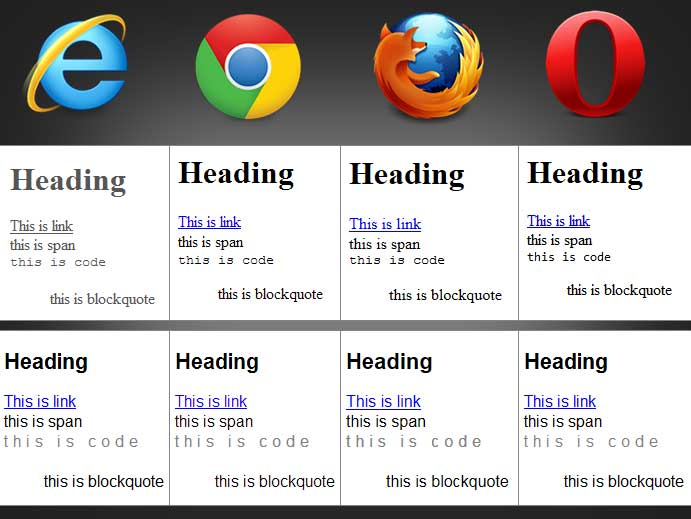

# Les 0: CSS_resets

Het komt vaak genoeg voor dat een website er in Google Chrome anders uitziet dan in (bijvoorbeeld) Firefox. Dit kan allerlei redenen hebben. Misschien mankeert er iets aan de code? Of misschien wordt de feature die je gebruikt wel ondersteund in de ene browser, maar (nog) niet in de andere. Een andere belangrijke oorzaak is dat elke browser ook zijn standaardinstellingen heeft voor marges, paddings, lettertypes en andere instellingen. Neem nou eens het volgende voorbeeld:



Eerder heb je geleerd dat je alle margin's en padding's kunt _resetten_ middels de volgende code:

```css
* {
  margin: 0px;
  padding: 0px;
}
```

Nu is dit een leuke truuc, maar handig is hij niet. Een * betekent namelijk dat _alle_ elementen in de HTML boom dezelfde stijl krijgen. Je kunt je hopelijk voorstellen dat bij een groot HTML document dit performancetechnisch niet het slimste is dat je kunt doen! Bovendien moet je eigenlijk meer resetten dan alleen de margin en de padding...

## Normalise.css
Gelukkig zijn er genoeg mensen die hier al eerder over hebben nagedacht. Zo heb je normalise.css. Dit is een css bestand dat je kunt gebruiken voor het resetten van alle broodnodige instellingen zonder dat dit ten koste gaat van de snelheid van je website. Grote bedrijven zoals Twitter en GitHub maken zelf ook gebruik van Normalise.css. Je kunt het <a href="https://necolas.github.io/normalize.css/">hier</a> downloaden.

## Gebruik normalise.css
Je kunt normalise.css op twee manieren gebruiken:
Approach 1: use normalize.css as a starting point for your own project’s base CSS, customising the values to match the design’s requirements.

Approach 2: include normalize.css untouched and build upon it, overriding the defaults later in your CSS if necessary.

Als je kiest voor de tweede benadering, dan kun je dat weer op twee manieren doen:
* Verwijzing naar normalise.css toevoegen in de HTML
```html
<link type="text/css" rel="stylesheet" href="normalize.css">
<!-- Voeg je eigen stylesheet hier toe -->
```

* Normalise.css importeren in je eigen CSS:
```css
@import url("normalise.css");
```
Let er wel op dat je verwijzing in ```href``` overeenkomt met de lokatie waar je normalise.css hebt neergezet.
