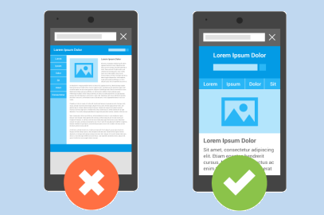
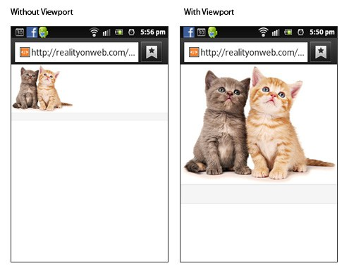
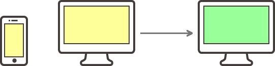
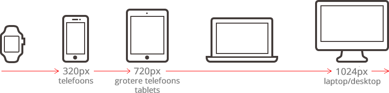

# Les 2: Maak je site responsive
De term _responsive_ is vrij nieuw. Het betekent dat je website zich aanpast aan de schermgrootte van het device waarmee je de website bezoekt. Vooral met de komst van smartphones, tablets, smart-tv's enz. is het erg belangrijk geworden om je website responsive te maken.

Want een website dat alleen voor een desktop bedoeld is, wil je eigenlijk niet op je smartphone bekijken.


De lettertypes zijn dan te klein, de menuknopjes zijn moeilijk aan te klikken, je moet dan steeds 'pinchen en zoomen', oftewel je vingers gebruiken om de website beter te kunnen bekijken. Daarom is het essentieel om websites _responsive_ te maken. De gebruiker moet namelijk zo min mogelijk moeite doen om de inhoud van de website goed te kunnen bekijken.

Wij gaan gebruik maken van CSS om dit voor elkaar te krijgen.

### VIEWPORT TAG
Allereerst zetten we een meta-tag in de head van onze pagina.

``` html
<meta name="viewport" content="width=device-width, initial-scale=1.0">
```
Met dit stukje code geef je aan dat de tablet of smartphone de website _niet_ moet herschalen (verkleinen) zodat de hele website in het scherm past. Het gevolg is dat je de website op ware grootte ziet, dezelfde grootte als op je computerscherm.

Het effect is als volgt:



Vervolgens moeten we gebruik maken van media queries.

### CSS3 MEDIA QUERIES
Sinds CSS3 kun je met media queries voor elk scherm de opmaak van je website bepalen. Dit doe je met een zogenaamde _at-rule_. De _at_ staat voor het apestaartje (@). Waarschijnlijk heb je al eerder met at-rules gewerkt bijvoorbeeld voor het gebruik van web-fonts (voor leerlingen uit de Coderclass: zie de module HTML&CSS-2). Voor een lijst van at-rules, zie https://developer.mozilla.org/en-US/docs/Web/CSS/At-rule

Hier een voorbeeld van de `media` at-rule:

```css
body {
  background-color: grey;
}

@media only screen and (max-width: 700px) {
    body {
      background-color: yellow;
    }
}
```
Hierboven staat _eerst_ dat de achtergrondkleur van de pagina grijs moet zijn. Maar als een scherm een maximum breedte van 700px heeft, dan wordt de achterkleur _overschreven_ met geel. Dat is dus waar de media-query goed voor is: het zorgt ervoor dat je opmaak kan specificeren voor een specifieke grootte van het scherm!

We breiden de CSS ietsjes uit:
```css
body {
  background-color: grey;
}

@media only screen and (max-width: 700px) {
    body {
      background-color: yellow;
    }
}
@media only screen and (max-width: 479px) {
  body {
    background-color: green;    
  }
}
```
Eerst wordt de achtergrond kleur grijs. En als het scherm maximaal 700px breed is, dan wordt de achtergrondkleur overschreven met _geel_, maar als het scherm _ook_ een maximum breedte van 479 pixels heeft, dan wordt de achtergrondkleur _weer_ overschreven, maar dan met _groen_. Laten we dit even proberen:

[](codepen://h-akkas/mpjeeQ?height=500&theme=0)

> *BELANGRIJK!* Vergroot en verklein je browserwindow zodat je de kleur ziet veranderen! De kleinere browserschermen worden voornamelijk op mobiele apparaten gebruikt, maar je kunt het responsive effect ook zien wanneer je het browserscherm op je desktop verkleint. De media queries kijken namelijk alleen maar naar de grootte het browserscherm, en niet naar de grootte van het scherm zelf.

### Mobile first design versus desktop first design
Bij mobiele apparaten is het belangrijk dat de stijlregels zo snel mogelijk worden geladen. Daarom wordt aangeraden om de stylesheet van een website te beginnen met het de stijlregels voor het kleinste schermformaat, en dan door te werken naar het grootste schermformaat.

Dit heet mobile first design.


Bij mobile first design begin je de stylesheet met alle regels die gelden voor het kleinste scherm vóór je met een media query controleert hoe groot het scherm is. Op die manier laadt de site sneller op een mobiel apparaat, alle regels die gelden voor een groter scherm hoeven niet te worden gelezen.

De stylesheets voor de meeste websites die nu draaien zijn nog opgezet volgens het _desktop first principe_.

Bij desktop first begin je met het grootste scherm, en werk je naar het kleinste scherm toe. De specifieke stijlregels voor je mobiele telefoon staan pas onderaan het bestand.


Voor de snelheid van je site op mobiele apparaten is deze methode nadelig, omdat:

* de browser eerst alle regels voor het grootste scherm leest én toepast
* daarna wordt met verschillende media queries de juiste grootte van het scherm bepaald
* waarna de browser de aanpassingen op de al toegepaste regels voor het kleinere scherm leest én toepast

Mobiele internetverbindingen worden steeds sneller, maar bij een groot CSS bestand kost het doorwerken van alle regels toch kostbare tijd. Staan de regels voor je mobiele design vooraan, dan is je site sneller geladen.

### Mobile first design
Stel dat je de volgende regels in je CSS bestand hebt staan:

```css
body {
    background-color: yellow;
}

@media only screen and (min-width: 900px) {
    body {
        background-color: green;
    }
}
```

Leest de browser op je mobiele telefoon deze regels, dan wordt de achtergrond van je website direct geel, en deze blijft geel omdat de grootte van het browserscherm niet voldoet aan het breakpoint van 900px in de media query, en de stijlregels in deze query niet toepast.

Leest de browser op je desktop deze regels, dan wordt de achtergrond eerst geel, en later maakt de media query de achtergrond groen omdat het grotere scherm wel voldoet aan het breakpoint van 900px in de media query, en die stijlregels wel worden toegepast.

Dit gaat zo snel dat je het normaliter niet ziet, maar mocht je een heel langzame verbinding met je site hebben, dan kun je de achtergrond eerst geel en dan groen zien worden.



### Desktop first design
Wil je hetzelfde bereiken in een CSS bestand dat desktop first is opgezet, dan moeten die regels hiervoor aangepast worden:


```css
body {
    background-color: green;
}

@media only screen and (max-width: 320px) {
    body {
        background-color: yellow;
    }
}
```

Op je desktop wordt de achtergrond van je website direct groen en blijft het groen. Leest je mobiele browser op je telefoon deze regels, dan wordt de achtergrond eerst groen en dan pas geel.


#### Gebruik breakpoints om de beste layout te gebruiken
De layout van je site ziet er goed uit op het scherm tot het er niet meer goed uitziet.

Het kan zijn dat de tekst te klein of te groot wordt om goed te lezen en bij de site te passen. Het kan ook zijn dat je een sidebar op je website gebruikt die je goed kunt zien op je desktop scherm, maar die bij een kleiner scherm wegvalt.

Het punt, waarop je de ene layout aanpast door een layout die beter past bij de gebruikte grootte van het browserscherm, noem je een breakpoint.

In het begin van responsive web design werden breakpoints vaak bepaald door de afmetingen van het scherm van een specifiek apparaat. Je maakte bijvoorbeeld een breakpoint voor het scherm van een Samsung Galaxy S3, het scherm van een Galaxy S4, een Galaxy S5, en ga zo maar door. En dan maakte je vaak ook nog breakpoints voor de oriëntatie van een scherm (of het apparaat staand of liggend wordt gebruikt).

Met alle verschillende merken, types, en schermmaten die er nu zijn, en alle nieuwe die er continu bijkomen, is dit geen goede oplossing. Gelukkig is het verschil in afmeting tussen de verschillende schermen vaak nihil, wat het maken van breakpoints al een stuk vereenvoudigd.

Beter kies je breakpoints op basis van het design van je website. Zorgvuldig gekozen breakpoints zorgen er ook voor dat je site altijd klaar is voor de nieuwste apparaten, zonder dat je daarvoor je stylesheet hoeft aan te passen.

Gebruik de grotere breakpoints
Je hebt minimaal drie breakpoints nodig om de verschillende types apparaten te scheiden: mobiele telefoons, tablets, en desktops en laptops. Moet je site ook goed werken op een smartwatch, dan moet je in ieder geval nog een vierde breakpoint toevoegen.



Lijst van standaard breakpoints
Je kunt heel ver komen als je breakpoints maak voor:

Alle apparaten waarbij de maximale breedte van het browserscherm:

kleiner is dan 320px
groter of gelijk is aan 320px
groter of gelijk is aan 720px
groter of gelijk is aan 1024px
Je kunt het, wanneer jouw design hierom vraagt, ingewikkelder maken en één of meerdere tussenliggende breakpoints maken, maar bovenstaande lijst is een goed begin.

De standaardlijst breakpoints vertaal je nu als volgt naar media queries:

#### Mobile first design

```css
/* stijlregels voor alle schermen kleiner dan 320px breed */

@media only screen and (min-width: 320px) {

    /* stijlregels voor browserschermen > 320px en < 720px */

}

@media only screen and (min-width: 720px) {

    /* stijlregels voor browserschermen > 720px en < 1024px */

}

@media only screen and (min-width:1024px) {

    /* stijlregels voor browserschermen ≥ 1024px */

}
```
### Desktop first design

```css
/* stijlregels voor schermen groter dan 1024px breed */

@media only screen and (max-width: 1024px) {

    /* stijlregels voor schermen > 720px en ≤ 1024px breed */

}

@media only screen and (max-width: 720px) {

    /* stijlregels voor schermen > 320px en ≤ 720px breed */

}

@media only screen and (max-width:320px) {

    /* stijlregels voor schermen ≤ 320px breed */

}
```

### Waar moet je nog meer op letten bij responsive design

#### Responsive afbeeldingen
In je responsive website wil je dat afbeeldingen zich ook automatisch aanpassen naar de grootte van je browserscherm. Dat doen ze standaard namelijk niet.

Is de originele afbeelding groter dan het scherm, dan moet de afbeelding zich aanpassen zodat deze in het scherm pas, liefst zonder vervormingen (ik heb sites gezien waarbij de breedte van de afbeeldingen zich aanpassen, maar de hoogte niet; je krijgt dan heel smalle, langgerekte afbeeldingen).

Je zorgt dat de afbeeldingen op je site zich gedragen door de volgende regels aan je stylesheet toe te voegen:


```css
img {
    height: auto;
    max-width: 100%;
}
```

Deze stijlregels zorgen ervoor dat de afbeelding maximaal 100% van de HTML container (zoals <div> of <article>) waarin deze staat breed mag zijn, en dat de hoogte zich automatisch in verhouding met die nieuwe breedte aanpast.
