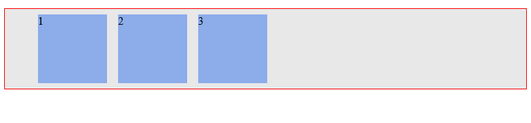

# Les 3: Introductie Flexbox
Flexbox is een tamelijk nieuwe layout manier waarmee je in een (div) container elementen horizontaal of verticaal kunt verdelen. Samen met grid kun je hiermee de meest ingewikkelde layouts maken. Laten we meteen beginnen met een voorbeeld:

Stel dat je de volgende galerij wilt maken:


Je wilt dus wat foto's naast elkaar hebben en de afstand tussen de foto's moeten gelijk zijn.

Eerst de HTML:
```html
<div id="container">
  <div class="box">
    
  </div>
  <div class="box">
      
  </div>
  <div class="box">
    
  </div>    
</div>
```

En de bijbehorende CSS:
```css
#container {
  background-color: yellow;
  display: flex;
  justify-content: space-evenly;
}

.box {
  background-color: green;
  width: 100px;
  height: 100px;
}
```

En het resultaat is:
[](codepen://h-akkas/Mrqwpx?height=150&theme=0)

Merk op dat het `display` eigenschap op het container element is ingesteld op `flex`. En met `justify-content` kunnen we instellen hoe de _flex-items_ in de container worden uitgelijnd. `space-evenly` betekent dat de ruimte tussen de flex-items precies eerlijk verdeeld wordt. Naast `space-evenly` heb je ook nog de volgende mogelijkheden:


| justify-content        | Betekenis           |
| ------------- |:-------------:|
| `justify-content: center;` |  |
| `justify-content: flex-start;` |  |
| `justify-content: flex-end;` |  |
| `justify-content: space-around;` |  |
| `justify-content: space-between;` |  |

Je kunt middels het onderstaande even kijken naar het effect van de verschillende opties:

[](codepen://h-akkas/JMaYmL?height=200&theme=0)


Stel dat je hier nou een foto bij zet, dan gaat is dat geen probleem. De plaatjes krijgen een nieuwe plek zodat de ruimte tussen de elementen gelijk blijft. Zie maar:
[](codepen://h-akkas/godavE?height=150&theme=0)

## Flex-direction
Met flex-direction kun je de richting van de flex-items bepalen. Standaard staan de items naast elkaar, van links naar rechts. Maar dat kun je aanpassen. Je kunt bijvoorbeeld zeggen:

```css
#container {
  background-color: yellow;
  display: flex;
  flex-direction: column;
  justify-content: space-evenly;
  width: 100px;
  height: 500px;
}
```
(De opmaak van `.box` is niet veranderd). Je ziet de property `flex-direction` ingesteld op column. Dat betekent dus dat de flex-items op elkaar worden gestapeld. Hieronder de uitwerking:

[](codepen://h-akkas/mpGevg?height=500&theme=0)

Naast de waarde `column` kun je ook de volgende waarden meegeven:
| flex-direction        | Betekenis           |
| ------------- |:-------------:|
| `justify-content: center;` |  |
| `justify-content: flex-start;` |  |
| `justify-content: flex-end;` |  |
| `justify-content: space-around;` |  |
| `justify-content: space-between;` |  |
